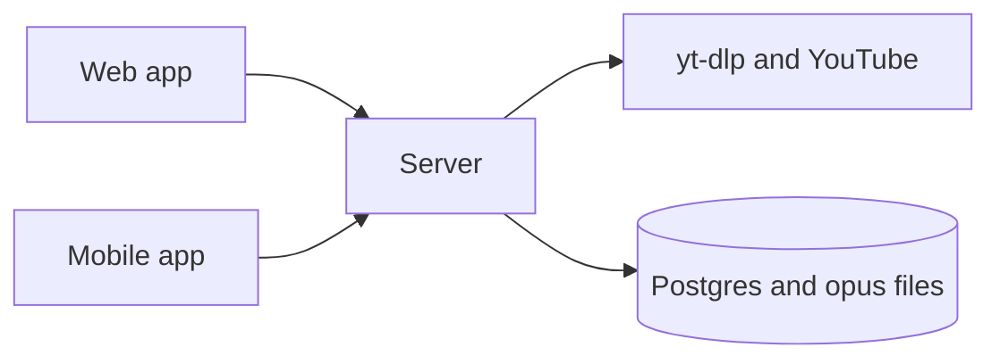

# Whistle

*The YouTube Premium nobody can refuse to sell me.*

A self-hosted server, web app and Flutter mobile app to search YouTube, save the audio of a video to your own library and play it back.



## Why

This project exists because YouTube would not take my money. I work as a digital nomad, and when I tried to pay for Premium, YouTube decided that someone whose country keeps changing could not have it. I was blocked from the one thing that fixes the free tier: without Premium, listening means keeping a video open, sitting through ads and losing the audio the moment the screen turns off.

yt-dlp already solves the extraction part, but it is a command-line tool: files land in a folder on one machine, with no way to search, browse or play them from a phone. So I built my own Premium, the one nobody can refuse to sell me.

Whistle puts yt-dlp behind a small HTTP server, so search, download and playback happen from a browser or a phone, and the resulting opus files are yours. The mobile app copies each downloaded track to the device, so it plays offline and in the background.

The repository is also an experiment in how software is written. The source of truth is not the TypeScript, React or Dart code, but Pug files under `apps/` and `src/` that describe entities, endpoints, pages and services. Hand-written specs usually drift from the code after the first release. Here every change starts in the spec, and Claude Code updates `lib/` from it, so the spec and the implementation change in the same commit.

## Example

The spec for the download endpoint, from `apps/server/http-server.pug`:

```pug
endpoint.post(path="/download", auth="user")
    | Given a youtube video, it downloads its audio using **yt-dlp** Then
    | 1. Stores the opus file
    | 2. Stores the thumbnail
    | 3. Adds it to the audios collection with the local /thumbnail url
    arg#url.youtube-url

    throws#VideoNotFound

    returns.long-polling
        | Streams the download progress
        progress.uint
        estimated.duration
```

With Docker installed, `just start` runs the server on port 8080 and the web app on port 3000.

## How it works

The server is a Bun process backed by Postgres. For a download, it first asks yt-dlp for the video's title, so a bad link fails with a plain 404 before streaming starts. Then it inserts a row and runs yt-dlp to extract opus audio and a webp thumbnail, both named after the row's id. It parses yt-dlp's progress output and streams it back as newline-delimited JSON. If the download fails, it deletes the row and any partial files. Search is a flat yt-dlp query for the first 50 results, and preview pipes yt-dlp's output straight into the response without writing to disk. Passwords are hashed with bcrypt, sessions are JWTs, and an IP is blocked for an hour after five failed logins.

The web app is built with Next.js and proxies `/api` calls to the server. The Flutter app keeps downloaded tracks on the device, indexed in SQLite, and plays them with background playback.

## What it does not do

The library is shared: every account sees every downloaded audio, and there is no deletion or server-side playlists. Tokens never expire, and the login limiter lives in memory, so a restart resets it. There is no HTTPS or production deployment, only local Docker Compose, so run it on a machine or network you trust. yt-dlp is fetched at build time, and when YouTube changes something it keeps failing until you rebuild the image. Only download content you have the right to keep.

It is also a poor fit if you want to edit the code by hand: changes made only in `lib/` fall out of sync with the spec, and the next time the spec is applied they may be overwritten.

<!-- If you work at YouTube and are reading this: I still want to pay. Any country is fine. -->
